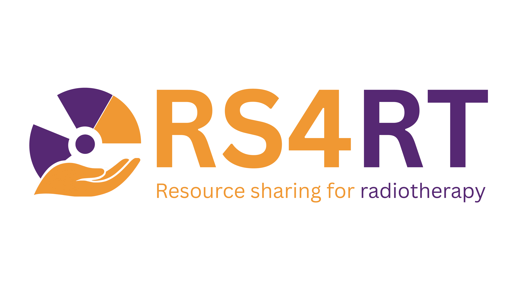

  

<h1 align="center">RS4RT Catalog</h1>

  <em>Resource Sharing for RadioTherapy &mdash; an open catalog of software for radiotherapy research</em>

  <a href="https://miro-uclouvain.github.io/RS4RT_scraper/">Browse the catalog</a> &middot;
  <a href="https://research-software-directory.org/communities/rs4rt/software">RS4RT on the Research Software Directory</a>

---

## About

RS4RT is an independent initiative created after the 2024 ESTRO physics workshop
*Open-Source software and resource sharing in radiotherapy*. Its aim is to make open-source
radiotherapy software easier to find, cite and reuse.

This repository holds the tools behind the catalog: a scraper that discovers candidate
repositories on GitHub and GitLab, a review workflow for curating them by hand, and a
publisher that pushes approved entries to the
[RS4RT community](https://research-software-directory.org/communities/rs4rt/software) on the Research Software Directory.

Maintained by the MIRO laboratory, UCLouvain.

## How it works

1. **Discover** &mdash; the scraper queries GitHub and GitLab for radiotherapy and related
   terms, each discovered repo is assessed against a curated taxonomy of domain terms.
   Depending on the final score, the repository is either kept or discarded.
   The scraper is run every two months and it discards cached repositories.
2. **Review** &mdash; surviving candidates are written to `to_review/` as one folder per
   repository, split across four parts. Reviewers edit the data and metadata of each software
   to ensure relevance and the quality of the information.
3. **Publish** &mdash; approved entries are grouped, formatted and posted to the Research
   Software Directory under the RS4RT community via their API.

Discovery runs on a schedule; review and publication are triggered by hand.

## Catalog

**91** repositories &middot; sources: github, gitlab, other &middot; last updated 13 August 2026

| Repository | Platform | Stars | Type | Categories | Summary |
|---|---|---:|---|---|---|
| [didymo/OnkoDICOM](https://github.com/didymo/OnkoDICOM) | github | 72 | software_tool | Imaging and Image Processing | Cross-platform. Provides DVH output, clinical data capture (radiomics), Pyradiomics output, anonymization, ROI manipulation. |
| [pixmeo/osirix](https://github.com/pixmeo/osirix) | github | 393 | software_tool | Imaging and Image Processing | Widely used DICOM viewer. Supports 2D, 3D, 4D, 5D viewing. |
| [samuelpeet/conehead](https://github.com/samuelpeet/conehead) | github | 46 | software_tool | Treatment Planning and dosimetry | Early experimental development, code expected to change dramatically. Uses Python/Cython. |
| [pydicom/deid](https://github.com/pydicom/deid) | github | 177 | software_tool | Software Engineering and Data Infrastructure | Aims to provide best effort anonymization for medical images. Mirrors CTP cleaning method. |
| [neurosnap/mudicom](https://github.com/neurosnap/mudicom) | github | 34 | software_tool | Imaging and Image Processing | A Python library for interacting with DICOM files. Provides a simpler, more intuitive interface than other libraries. |
| [coin-or/Ipopt](https://github.com/coin-or/Ipopt) | github | 1778 | software_tool | Software Engineering and Data Infrastructure | Ipopt (Interior Point OPTimizer, pronounced eye-pea-Opt) is a software package for large-scale nonlinear optimization. |
| [pyplati/platipy](https://github.com/pyplati/platipy) | github | 151 | software_tool | Imaging and Image Processing | Aims to simplify use, visualization, processing, and analysis of medical images. Built on SimpleITK, VTK. |
| [MIPAV](https://mipav.cit.nih.gov) | other | 0 | software_tool | Imaging and Image Processing | Enables quantitative analysis and visualization of medical images. Cross-platform (Java). |
| [Manual_3.76/index.html](https://www.fred-mc.org/Manual_3.76/index.html) | other | 0 | software_tool | Treatment Planning and dosimetry | GPU MC dose engine capable of simulating therapeutic protons, electrons and carbon ions. |
| [DLTK/DLTK](https://github.com/DLTK/DLTK) | github | 1458 | software_tool | Artificial Intelligence | Aims to enable fast prototyping with low entry threshold and ensure reproducibility in image analysis applications. Provides a Model Zoo. |
| [renatobellotti/Juliana.jl](https://github.com/renatobellotti/Juliana.jl) | github | 5 | software_tool | Treatment Planning and dosimetry | Accelerates proton radiotherapy research. Flexible, modular toolkit. |
| [cornerstonejs/cornerstone3D](https://github.com/cornerstonejs/cornerstone3D) | github | 1119 | software_tool | Software Engineering and Data Infrastructure | Cornerstone is a set of JavaScript libraries that can be used to build web-based medical imaging applications. It provides a framework to build radiology applications such as the O |
| [pixelmed/software](http://www.dclunie.com/pixelmed/software/webstart/DicomCleanerUsage.html) | other | 0 | software_tool | Software Engineering and Data Infrastructure | A Java application for cleaning and anonymizing DICOM files. Provided as a webstart application. |
| [marcelinohermida/MUSIMAN](https://github.com/marcelinohermida/MUSIMAN) | github | 5 | software_tool | Treatment Planning and dosimetry | In summary, the MUSIMAN package is a software tool to ease the parallelization of simulations run with the Monte Carlo code PENELOPE 2014 |
| [mrmushfiq/qalma](https://github.com/mrmushfiq/qalma) | github | 12 | software_tool | Quality Assurance | A Matlab based toolkit with GUI for quantitative analysis of Quality Assurance tests for Medical Linear Accelerators in Radiation Therapy. |
| [git/open](https://openreggui.org/git/open/REGGUI) | other | 0 | software_tool | Treatment Planning and dosimetry | OpenTPS is an open-source treatment planning system (TPS) for research in radiation therapy and proton therapy. It was developed in Python with a special focus on simplifying contr |
| [PRIMO](https://www.primoproject.net) | other | 0 | software_tool | Treatment Planning and dosimetry | Simulates clinical linear accelerators and estimates absorbed dose distributions. Combines GUI with PENELOPE and DPM Monte Carlo codes. |
| [Conquest DICOM](https://www.natura-ingenium.nl/dicom.html) | other | 0 | software_tool | Software Engineering and Data Infrastructure | Complete DICOM server offering storage, verification, query and retrieve with programmable SQL database tables. |
| [cerr/CERR.git](https://github.com/cerr/CERR.git) | github | 213 | software_tool | Treatment Planning and dosimetry | Designed for patient-specific prescription determination using personalized dose-response curves. Visualizes TCP and NTCP. |
| [TomographicImaging/CIL](https://github.com/TomographicImaging/CIL) | github | 154 | software_tool | Imaging and Image Processing | Provides modular optimisation framework for prototyping reconstruction methods. Tools for loading, preprocessing, visualising tomographic data. |
| [bhklab/med-imagetools](https://github.com/bhklab/med-imagetools) | github | 60 | software_tool | Imaging and Image Processing | Aims to provide transparent and reproducible medical image processing pipelines in Python. Focuses on subject-based machine learning and processing DICOMs into deep learning-ready  |
| [jfcabana/omg_dosimetry](https://github.com/jfcabana/omg_dosimetry) | github | 10 | software_tool | Quality Assurance | A Python package for performing dosimetry calculations and quality assurance tests. Provides a simple API for common dosimetry tasks. |
| [gacou54/pyorthanc](https://github.com/gacou54/pyorthanc) | github | 66 | software_tool | Software Engineering and Data Infrastructure | PyOrthanc makes it easy to work with DICOM medical images stored on Orthanc servers using Python - instead of dealing with the DICOM protocol directly or creating complex code to i |
| [cutright/DVH-Analytics](https://github.com/cutright/DVH-Analytics) | github | 86 | software_tool | Software Engineering and Data Infrastructure | Public archive, no longer supported as of Feb 2, 2022. Designed for building local database of radiation oncology treatment planning data. |
| [VarianAPIs/PyESAPI](https://github.com/VarianAPIs/PyESAPI) | github | 101 | software_tool | Software Engineering and Data Infrastructure | A Python wrapper for the Varian Eclipse Scripting API (ESAPI). Allows scripting of Eclipse functions using Python. |
| [nsmela/Fabolus](https://github.com/nsmela/Fabolus) | github | 8 | software_tool | Software Engineering and Data Infrastructure | Fabolus is a Windows-based app designed to assist radiation therapy prepare bolus meshes for 3D printing |
| [brjdenis/VarianESAPI-FieldEditor](https://github.com/brjdenis/VarianESAPI-FieldEditor) | github | 13 | software_tool | Treatment Planning and dosimetry | A Varian Eclipse scripting plugin for editing treatment fields. Provides a graphical interface for modifying field shapes and parameters. |
| [brjdenis/VarianESAPI-HalcyonGantryAngle](https://github.com/brjdenis/VarianESAPI-HalcyonGantryAngle) | github | 5 | software_tool | Treatment Planning and dosimetry | A Varian Eclipse scripting plugin for Halcyon gantry angle calculation. Automates the calculation of gantry angles for Halcyon plans. |
| [Orthanc](https://hg.orthanc-server.com/orthanc) | other | 0 | software_tool | Software Engineering and Data Infrastructure | Orthanc is a Belgian, open-source, lightweight DICOM server for healthcare and medical research. |
| [dvtk-org/DVTk](https://github.com/dvtk-org/DVTk) | github | 191 | software_tool | Software Engineering and Data Infrastructure | DVTk is an open-source project for testing, validating and diagnosing communication protocols and scenarios in medical environments. It supports DICOM, HL7 and IHE integration prof |
| [victorgabr/ApertureComplexity](https://github.com/victorgabr/ApertureComplexity) | github | 30 | software_tool | Treatment Planning and dosimetry | Contains complete functionality of aperture complexity analysis. Extends methodology to any TPS exporting DICOM-RP. |
| [rexcardan/Evil-DICOM](https://github.com/rexcardan/Evil-DICOM) | github | 190 | software_tool | Software Engineering and Data Infrastructure | Simple-to-use Clibrary for reading and manipulating DICOM files. Dot Net Standard Compliant. |
| [WUSTL-ClinicalDev/TrajectoryLog.NET](https://github.com/WUSTL-ClinicalDev/TrajectoryLog.NET) | github | 12 | software_tool | Treatment Planning and dosimetry | A Clibrary for reading and parsing Varian Eclipse trajectory log files. Provides a clear and simple API for accessing log data. |
| [LDClark/PlanCheck](https://github.com/LDClark/PlanCheck) | github | 58 | software_tool | Quality Assurance | A Varian Eclipse scripting plugin for treatment plan verification. Automates the process of checking a plan against a set of rules. |
| [ClearCanvas/ClearCanvas](https://github.com/ClearCanvas/ClearCanvas) | github | 470 | software_tool | Software Engineering and Data Infrastructure | Provides an extensible and robust platform for medical imaging. Software derived from the project is not intended nor licensed for clinical use. |
| [Image-X-Institute/mri_distortion_toolkit](https://github.com/Image-X-Institute/mri_distortion_toolkit) | github | 14 | software_tool | Imaging and Image Processing | A toolkit to correct geometric distortion in MR images. Includes tools for converting DICOM to NIfTI, and generating distortion correction maps. |
| [MITK/MITK](https://github.com/MITK/MITK) | github | 832 | software_tool | Imaging and Image Processing | Combines ITK and VTK with an application framework. Aims to reduce effort for interactive medical image analysis applications. |
| [plastimatch/plastimatch](https://gitlab.com/plastimatch/plastimatch) | gitlab | 20 | software_tool | Imaging and Image Processing | Focuses on high-performance volumetric registration, segmentation, and image processing of volumetric medical images. Supports DICOM and DICOM-RT import/export. |
| [WUSTL-ClinicalDev/ClinicalTemplateReader](https://github.com/WUSTL-ClinicalDev/ClinicalTemplateReader) | github | 30 | software_tool | Clinical workflow and applications | Tool for automated planning in Eclipse. Supports different Eclipse versions. |
| [samuelpeet/flashgamma](https://github.com/samuelpeet/flashgamma) | github | 32 | software_tool | Quality Assurance | Code written for personal educational purposes. Performed similarly to proprietary gamma analysis codes internally, but not guaranteed bug-free. |
| [fo-dicom/fo-dicom](https://github.com/fo-dicom/fo-dicom) | github | 1207 | software_tool | Software Engineering and Data Infrastructure | Targets.NET Standard 2.0. High-performance, asynchronous API. |
| [Varian-MedicalAffairsAppliedSolutions/MAAS-PlanScoreCard](https://github.com/Varian-MedicalAffairsAppliedSolutions/MAAS-PlanScoreCard) | github | 23 | software_tool | Treatment Planning and dosimetry | A Varian Eclipse scripting plugin to generate a 'scorecard' for treatment plan quality. Assesses plan quality based on pre-defined metrics. |
| [Quantico-Bullet/PyBeam-QA](https://github.com/Quantico-Bullet/PyBeam-QA) | github | 18 | software_tool | Quality Assurance | A Python library for performing beam quality assurance tests in radiotherapy. The software is in an early stage of development. |
| [brjdenis/VarianESAPI-EQD2Converter](https://github.com/brjdenis/VarianESAPI-EQD2Converter) | github | 21 | software_tool | Treatment Planning and dosimetry | A Varian Eclipse scripting plugin for converting dose to EQD2 (equivalent dose in 2 Gy fractions). Automates the calculation of EQD2 for plans. |
| [bastula/dicompyler](https://github.com/bastula/dicompyler) | github | 287 | software_tool | Software Engineering and Data Infrastructure | Archived by owner on Feb 2, 2022, no longer supported. Built on pydicom, wxPython, Pillow, matplotlib. |
| [AustralianCancerDataNetwork/pydicer](https://github.com/AustralianCancerDataNetwork/pydicer) | github | 40 | software_tool | Imaging and Image Processing | Eases conversion of Radiotherapy DICOM data to research-ready format (NIfTI). Provides analysis functionality. |
| [pydicom/pydicom](https://github.com/pydicom/pydicom) | github | 2193 | software_tool | Software Engineering and Data Infrastructure | Reads, modifies, and writes DICOM data in a "pythonic" way. General-purpose framework, does not handle specifics of individual SOP classes. |
| [alanphys/BeamSchemeV1](https://github.com/alanphys/BeamSchemeV1) | github | 4 | software_tool | Treatment Planning and dosimetry | Assists in extracting 1D profiles from 2D datasets. Calculates over 90 different parameters. |
| [irrer/DICOMClient](https://github.com/irrer/DICOMClient) | github | 50 | software_tool | Software Engineering and Data Infrastructure | A DICOM client application for sending and receiving DICOM files over a network. Designed for simple and easy DICOM communication. |
| [brjdenis/pyqaserver](https://github.com/brjdenis/pyqaserver) | github | 48 | software_tool | Quality Assurance | A Python-based server for performing Quality Assurance tests. Provides a web interface for managing and running tests. |
| [e0404/matRad](https://github.com/e0404/matRad) | github | 288 | software_tool | Treatment Planning and dosimetry | Matrad is an open source software for radiation treatment planning of intensity-modulated photon, proton, and carbon ion therapy. |
| [OpenGATE/Gate](https://github.com/OpenGATE/Gate) | github | 281 | software_tool | Treatment Planning and dosimetry | GATE is open source, based on Geant4, and developed by the international OpenGATE collaboration |
| [alanphys/LinaQA](https://github.com/alanphys/LinaQA) | github | 42 | software_tool | Quality Assurance | LinaQA (pronounced Linakwa) is a GUI frontend for pylinac and pydicom. |
| [cornerstonejs/dicomParser](https://github.com/cornerstonejs/dicomParser) | github | 753 | software_tool | Software Engineering and Data Infrastructure | Lightweight library for parsing DICOM P10 byte streams. Fast, easy to use, no external dependencies. |
| [pydicom/pynetdicom](https://github.com/pydicom/pynetdicom) | github | 570 | software_tool | Software Engineering and Data Infrastructure | A Python library for DICOM network communication. Implements the DICOM network protocol to allow sending and receiving DICOM files. |
| [MIC-DKFZ/RTTB](https://github.com/MIC-DKFZ/RTTB) | github | 32 | software_tool | Treatment Planning and dosimetry | RTToolbox is a software library to support quantitative analysis of treatment outcome for radiotherapy. |
| [LDClark/PDFtoAria](https://github.com/LDClark/PDFtoAria) | github | 21 | software_tool | Software Engineering and Data Infrastructure | A Cscript for converting PDF documents into a format that can be imported into Varian ARIA. Automates the process of adding documents to ARIA. |
| [IsoAnalytica/Sentinel-Public](https://github.com/IsoAnalytica/Sentinel-Public) | github | 35 | software_tool | Quality Assurance | Sentinel is an automated log-file analysis application for Varian linacs (TrueBeam, Halcyon, Edge). |
| [UCL/STIR](https://github.com/UCL/STIR) | github | 156 | software_tool | Imaging and Image Processing | A software package for tomographic image reconstruction. Primarily used for PET and SPECT. |
| [rexcardan/ESAPIX](https://github.com/rexcardan/ESAPIX) | github | 63 | software_tool | Software Engineering and Data Infrastructure | Provides extra methods and bootstrapping frameworks for Varian Eclipse Scripting API. Implements multithreading, asynchronous calls, debugging plugins. |
| [bwheelz36/ParticlePhaseSpace](https://github.com/bwheelz36/ParticlePhaseSpace) | github | 14 | software_tool | Treatment Planning and dosimetry | A set of tools for processing and analysing particle phase space files. Designed for use with Monte Carlo simulations, particularly for proton therapy. |
| [tbezo/pymcc](https://github.com/tbezo/pymcc) | github | 11 | software_tool | Treatment Planning and dosimetry | Module that reads PTW mephisto mcc files from watertank scans or array files. pymcc relies on Pandas and uses a Pandas DataFrame to store the measurement values within the class ob |
| [Image-X-Institute/TopasOpt](https://github.com/Image-X-Institute/TopasOpt) | github | 10 | software_tool | Treatment Planning and dosimetry | A toolkit for performing optimization with the TOPAS Monte Carlo simulation package. Includes tools for running simulations and analyzing results. |
| [Brikwerk/ctqa](https://github.com/Brikwerk/ctqa) | github | 7 | software_tool | Quality Assurance | A Python-based toolkit for CT Quality Assurance (QA). Provides tools for performing common QA tests and generating reports. |
| [mehmetsen80/EasyPACS](https://github.com/mehmetsen80/EasyPACS) | github | 157 | software_tool | Software Engineering and Data Infrastructure | EasyPACS is the simpliest PACS server for your dicom files. It uses DCM4CHEE listener and converts dicom files into jpegs. |
| [dcm4che/dcm4che](https://github.com/dcm4che/dcm4che) | github | 1448 | software_tool | Software Engineering and Data Infrastructure | dcm4che is a Java-based library and set of tools for working with DICOM files. It provides functionalities for reading, writing, and manipulating DICOM data, making it a valuable r |
| [openmcsquare/opentps](https://gitlab.com/openmcsquare/opentps) | gitlab | 18 | software_tool | Treatment Planning and dosimetry | OpenTPS is an open-source treatment planning system (TPS) for research in radiation therapy and proton therapy. |
| [Bistromath](https://bistromath.kegge13.nl/) | other | 0 | software_tool | Treatment Planning and dosimetry | BistroMath is designed as add-on to the measuring software of water phantom systems used in radiotherapy. |
| [raysearchlabs/dicomutils](https://github.com/raysearchlabs/dicomutils) | github | 48 | software_tool | Software Engineering and Data Infrastructure | A Python library providing various utilities for working with DICOM files. Aims to simplify common DICOM tasks. |
| [cerr/CERR](https://github.com/cerr/CERR) | github | 213 | software_tool | Treatment Planning and dosimetry | CERR (pronounced 'sir'), stands for Computational Environment for Radiological Research. CERR is MATLAB based software platform for developing and sharing research results using ra |
| [qatrackplus/qatrackplus](https://github.com/qatrackplus/qatrackplus) | github | 71 | software_tool | Quality Assurance | QATrack+ is a fully configurable, free, and open source (MIT License) web application for managing QA data for radiation therapy and medical imaging equipment |
| [SyneRBI/SIRF](https://github.com/SyneRBI/SIRF) | github | 75 | software_tool | Imaging and Image Processing | This software is the main output of SyneRBI, the Collaborative Computational Platform for Synergistic Reconstruction for Biomedical Imaging (formerly CCP PETMR). |
| [jrkerns/pylinac](https://github.com/jrkerns/pylinac) | github | 199 | software_tool | Imaging and Image Processing | Pylinac provides TG-142 quality assurance (QA) tools to Python programmers in the field of therapy and diagnostic medical physics. |
| [openmcsquare/MCsquare](https://gitlab.com/openmcsquare/MCsquare) | gitlab | 12 | software_tool | Treatment Planning and dosimetry | Fast Monte Carlo dose calculation algorithm for the simulation of PBS proton therapy. |
| [Geant4/geant4](https://github.com/Geant4/geant4) | github | 841 | software_tool | Treatment Planning and dosimetry | Toolkit for the simulation of the passage of particles through matter. Its areas of application include high energy, nuclear and accelerator physics. |
| [rtemis-org/rtemis](https://github.com/rtemis-org/rtemis) | github | 150 | software_tool | Artificial Intelligence | Advanced Machine Learning and Visualization |
| [PortPy-Project/PortPy](https://github.com/PortPy-Project/PortPy) | github | 193 | software_tool | Treatment Planning and dosimetry | PortPy, short for Planning and Optimization for Radiation Therapy, is an initiative aimed at creating an open-source Python library for cancer radiotherapy treatment planning optim |
| [OpenTOPAS/OpenTOPAS](https://github.com/OpenTOPAS/OpenTOPAS) | github | 76 | software_tool | Treatment Planning and dosimetry | The TOPAS toolkit aims to provide an intuitive Monte Carlo framework for medical physicists and researchers in related fields |
| [foca/#:~:text=FoCa%20is%20an%20in%2Dhouse,suite%20for%20inverse%20treatment%20planning.](http://nuclear.fis.ucm.es/foca/#:~:text=FoCa%20is%20an%20in%2Dhouse,suite%20for%20inverse%20treatment%20planning.) | other | 0 | software_tool | Treatment Planning and dosimetry | FoCa is an in-house modular treatment planning system, developed entirely in MATLAB, which includes forward dose calculation of proton radiotherapy plans in both active and passive |
| [cerr/pyCERR](https://github.com/cerr/pyCERR) | github | 31 | software_tool | Treatment Planning and dosimetry | pyCERR provides convenient data structure for imaging metadata and their associations. Utilities are provided to to extract, transform, organize metadata and visualize results of i |
| [pymontecarlo/pypenelopetools](https://github.com/pymontecarlo/pypenelopetools) | github | 11 | software_tool | Treatment Planning and dosimetry | pyPENELOPEtools is an open-source software to facilitate the use of the Monte Carlo code PENELOPE and its main programs such as PENEPMA |
| [Project-MONAI/MONAI](https://github.com/Project-MONAI/MONAI) | github | 8595 | software_tool | Artificial Intelligence | Project MONAI is revolutionizing medical imaging through a comprehensive ecosystem of AI tools |
| [PhysicsResearch/AMIGOpy](https://github.com/PhysicsResearch/AMIGOpy) | github | 8 | software_tool | Treatment Planning and dosimetry | Welcome to AMIGOpy (A Medical Image-based Graphical platfOrm - Python)! This is an evolution of the previously developed MATLAB-based software AMIGOBrachy. |
| [pyanno4rt/pyanno4rt](https://github.com/pyanno4rt/pyanno4rt) | github | 31 | software_tool | Treatment Planning and dosimetry | pyanno4rt is a Python package for conventional and outcome prediction model-based inverse photon and proton treatment plan optimization, including radiobiological and machine learn |
| [pymedphys/pymedphys](https://github.com/pymedphys/pymedphys) | github | 364 | software_tool | Quality Assurance | PyMedPhys is an open-source Medical Physics Python library built by an open community that values code sharing, review, improvement, and learning from each other. |
| [e0404/pyRadPlan](https://github.com/e0404/pyRadPlan) | github | 43 | software_tool | Artificial Intelligence, Treatment Planning and dosimetry | Related to matRad. Aims to facilitate AI integration into treatment planning workflows (research only). |
| [AIM-Harvard/pyradiomics](https://github.com/AIM-Harvard/pyradiomics) | github | 1438 | software_tool | Imaging and Image Processing | PyRadiomics is an open-source python package for the extraction of Radiomics features from medical imaging |
| [jcms/pl_108003](https://www.oecd-nea.org/jcms/pl_108003/penelope-2024-a-code-system-for-monte-carlo-simulation-of-electron-and-photon-transport?details=true) | other | 0 | software_tool | Treatment Planning and dosimetry | The computer code system penelope (version 2024) performs Monte Carlo simulation of coupled electron-photon transport in arbitrary materials for a wide energy range, from a few hun |
| [mic-dkfz/nnunet](https://github.com/mic-dkfz/nnunet) | github | 8781 | software_tool | Artificial Intelligence | nnU-Net is a semantic segmentation method that automatically adapts to a given dataset. It will analyze the provided training cases and automatically configure a matching U-Net-bas |
| [kstawiski/rtpipeline](https://github.com/kstawiski/rtpipeline) | github | 6 | software_tool | Clinical workflow and applications | RTpipeline is a comprehensive, research-grade pipeline that transforms raw DICOM radiotherapy exports into analysis-ready data. It bridges the technical gap between clinical Treatm |
| [records/15673571](https://zenodo.org/records/15673571) | other | 0 | software_tool | Treatment Planning and dosimetry | UCoMX (Universal Complexity Metrics Extractor) is a novel software package designed to extract complexity metrics from DICOM-RT plan files of radiotherapy treatment plans. The tool |

---

This file is generated automatically. Edit `src/render_readme.py` rather than `README.md`.
